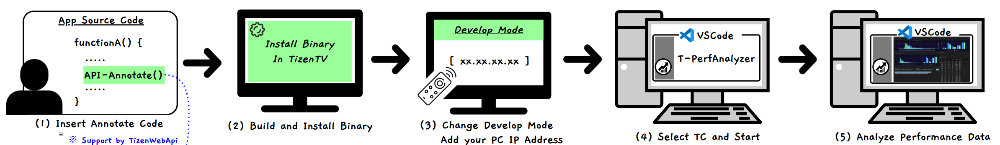
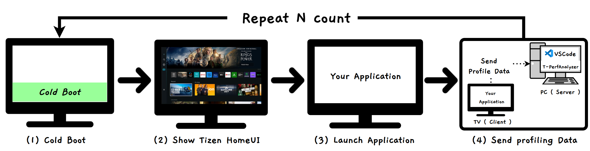

# T-Perf-Analyzer: Performance Analysis Tool for Tizen TV Platform

## ✔️ Overview  
Tizen(tv)-Perf-Analyzer is a VS Code extension for measuring and analyzing application performance on the Tizen platform. This tool provides automated performance metrics for TV applications, helping developers optimize app performance under real-world conditions.


## ✔️ Prerequisites  
- **VS Code**: Version **1.54.0 or higher** (update to the latest version if needed).  
- **Target TV**: Only supports TVs manufactured in **2025 or later**.
- **🚨Critical Precondition**: Your application **must be rebuilt** to enable to gather cpu/memory usage of app

## ✔️ Key Features  
- **Automated Measurement**: Collects performance data (e.g., app launch time, CPU/memory usage) automatically.  
- **Visual Analysis**: Displays metrics in charts and tables for easy interpretation.

---

## 📌 Installation Guide
1. Open VS Code and navigate to **Extensions** (`Ctrl+Shift+X`).  
2. Search for **"T-PerfAnalyzer"** and install it.
3. Reload VS Code after installation.

## 📌 Configuration Guide
1. **Terms of Service Agreement**
    To use T-PerfAnalyzer:  
    1. Open **VS Code Settings** (`Ctrl+,`)  
    2. Navigate to **Extensions → T-PerfAnalyzer configuration**  
    3. Set **TermsOfServiceAgreement** to `Agree`  
    - *Mandatory Step*: Tool functionality will be disabled if not agreed  

2. **Workspace Setting**  
    To configure data storage:  
    1. In the same configuration panel:  
    - Locate **Workspace Setting** under T-PerfAnalyzer settings  
    2. Enter your preferred data storage path:  
    - Example: `D:\\workspace`  
    - *Note*: This is where all measurement data from TV → PC transfers will be saved  
    3. Save changes  

## 📌 How to insert Annotations
Insert profiling markers in your app code using Tizen Web API
```javascript
<script src="$WEBAPIS/webapis/webapis.js"></script>
// ✅ Good Example (Unique)
webapis.appcommon.recordProfiling("MAIN_INITIALIZE_START");
// ... activity initialization code ...
webapis.appcommon.recordProfiling("MAIN_INITIALIZE_END");
// ❌ Bad Example (Non-Unique)
webapis.appcommon.recordProfiling("start"); //Ambiguous label
```

## 📌 Measurement Guide


1. **Connect to Target TV**:
   - Activate Developer Mode on TV:
    - Go to **TV App Settings**
    - Use the remote control to input **12345**
    - Enter **PC's IP address** in dialog
    - Reboot to enable **Developer Mode**
   - Ensure **PC’s IP address** in the extension’s configuration panel(Automatically entered)
   
2. **Configure Test Parameters**:
   - **TcType** Select `AppLaunchTest` (currently the only supported option)
   - **TcFile**
     - *Create New*:Click `Create New Test Case` -> Enter `TcName` and `AppId` -> Click `Save`
     - *Modify Existing*: Click `Create New Test Case` → Select existing TcFile → Edit → Click `Save`  
     - *Use Existing*: Select pre-configured test case from dropdown  
   - **BootType**:  
     - `Coldboot`: Launches app immediately after reboot  
     - `Idle`: Launches app 3 minutes after reboot (system enters idle state)  
   - **TcCount**: Enter number of test iterations (Note: System reboots after each test case)


3. **Run Analysis**:  
   - Click **"Start "** to begin measurement.
   - Check real-time logs and connection status under the **TV Target Connection** panel
   - After measurement completes, Click the **refresh icon** (⟳) in the left-bottom **App Launch Data** panel

+ **Measurement Timing**
   -**Start Point**: Begins at `on_click` event
   -**End Point**: Defaults to `on_resume` event

## 📌 Analysis Guide


### 1. Select Data for Analysis  
1. In the **App Launch Data** panel:  
   - Select datasets for comparison (2 recommended for optimal analysis)  
   - *Note*: Excessive selections may reduce analysis clarity  

### 2. Interpret Results
**A. Histogram Analysis (Top-Left)**  
- **Visual Chart**: Shows time distribution of measurement results  
- **Pattern Detection**:  
  - Right-skewed histogram → Indicates frequent long launch times

**B. Statistical Analysis (Top-Right)**  
- **Key Metrics**:  
  - Min/Max/Average values
  - Standard deviation (cv) (σ)
  - Test count (n)

**C. Interval Comparison (Bottom-Left)**  
1. **Select Annotation Range**:  
   - Choose start/end points using annotation markers  
2. **Performance Analysis**:  
   - Histogram: Time distribution for selected interval  
   - Min-Max Chart: Range comparison across test iterations  
   - *Usage*: Identify which intervals most impact overall performance  

**D. Version-Wise Analysis (Bottom-Right)**  
- **Data Table**:  
  | File(Iteration) | Start | End | Diff(Duration) | System Profiler | Annotation Profiler |  
  |-----------|----------|----------|----------|-----------------|---------------------|  
  | 1         | 1s     | 2.2s     | 1.2s     | [Go to]         | [Go to]             |  

- **Detailed Analysis Tools**:  
   - **System Profiler**:  
     - CPU/Memory usage trends over time  
     - Thread-level resource consumption analysis  
   - **Annotation Profiler**:  
     - Compare CPU/memory impact across annotation intervals  
     - Select specific threads for targeted analysis  

---

## ❔ Q&A and Support  
For technical inquiries or bug reports, please submit issues via:  
**[Git Issues](https://github.com/Samsung/T-PerfAnalyzer)**  

## ✔️ License  
This project uses **Apache ECharts**, which is distributed under the **Apache License 2.0**.  
Please refer to the details below for the license and copyright information.

- **Library Name**: Apache ECharts  
- **License**: [Apache License 2.0](https://www.apache.org/licenses/LICENSE-2.0)
- **Purpose** : Implementation of data visualization rendering logic based on ECharts

Copyright 2025 Samsung Electronics Co., Ltd.

Licensed under the Apache License, Version 2.0 (the "License");
you may not use this file except in compliance with the License.
You may obtain a copy of the License at
    http://www.apache.org/licenses/LICENSE-2.0

Unless required by applicable law or agreed to in writing, software
distributed under the License is distributed on an "AS IS" BASIS,
WITHOUT WARRANTIES OR CONDITIONS OF ANY KIND, either express or implied.
See the License for the specific language governing permissions and
limitations under the License.


--- 

**Note**: This tool is designed for internal use with specific TV models. Ensure compliance with annotation deletion policies outlined in the Terms of Service.
